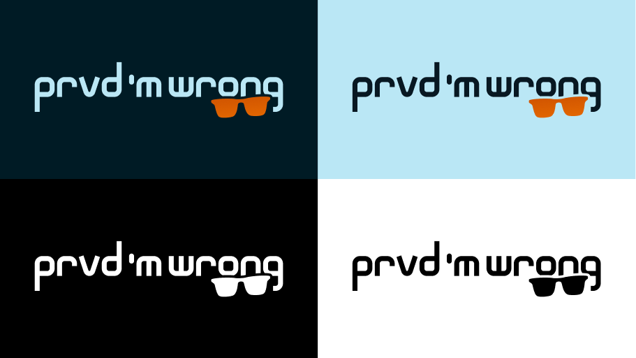

# Branding

Life's too short to be boring. Prvd 'M Wrong brand is playful and creative, but
we're keen to keep things high quality. If you use our work, please make it
tasteful and send it to us for approval.

All assets are considered open-source contributions and should be used according
to open standards and licensing rules.

---

## Logo

Please do not edit, change, distort, recolor, or reconfigure the Prvd 'M Wrong
logo.

---

## Colors

The Prvd 'M Wrong brand colors, derived from Oklch, are used in the logo and
most illustrations. They might not be suitable for text or all backgrounds.

<section class="grid pmwdoc-brand-colors" markdown>

<section style="background-color: oklch(0.6 0.186 52.985);" markdown>

Sunglass Orange

\#D15500
 
LCH 0.6 0.186 52.985

</section>

<section style="background-color: oklch(0.65 0.186 52.985);" markdown>

Summer Gold

\#E26600
 
LCH 0.65 0.186 52.985

</section>

<section style="background-color: oklch(0.9 0.05 220); color: oklch(0.2 0.05 220);" markdown>

Subzero White

\#BAE7F5
 
LCH 0.9 0.05 220

</section>

<section style="background-color: oklch(0.2 0.05 220); color: oklch(0.9 0.05 220); border-color: oklch(0.9 0.05 220 / 0.15);" markdown>

Abyss Black

\#001B25
 
LCH 0.2 0.05 220

</section>

</section>
s
