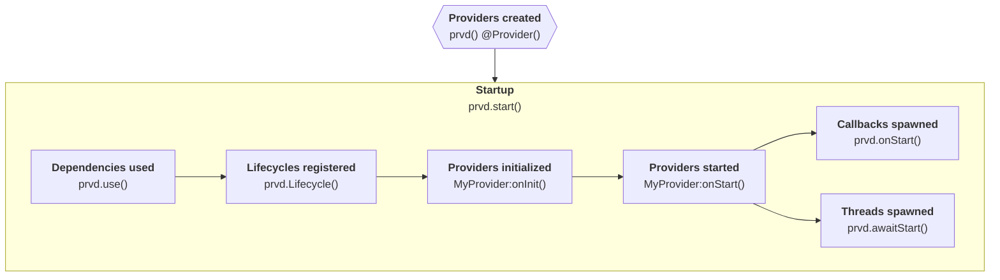

# Execution Order

Prvd 'M Wrong initializes providers following a predefined execution order
outlined below.

Libraries that interacts with Prvd 'M Wrong should understand the exact sequence
in which providers are initialized, ensuring correct functionality and prevent
potential conflicts or unexpected behaviors.

<section style="text-align: center;">

</section>

## Prior to Startup

Providers are registered through `prvd()` for Luau and `@Provider()` for
TypeScript. Providers must be created prior to startup, or Prvd 'M Wrong will
throw an error.

Lifecycle objects must be created prior to startup for providers to register it.
It's recommended to register a lifecycle object inside a provider module.

## Startup

`prvd.start()` instantiates the startup procedure. After it has been called, no
more providers will be registered and existing providers will not register newer
lifecycle objects.

Prvd 'M Wrong will first resolve all dependencies. Providers with `use()`d
dependencies will have it injected. Prvd 'M Wrong will topologically sort
providers so dependents run after dependencies.

Afterwards, all providers will register itself to all appropriate lifecycle
objects. The initialization and start lifecycles are registered beforehand.

Providers that implement the `onInit` lifecycle will be initialized
sequentially based on the topological sort done earlier. `onInit` methods are
expected to never throw, and preferably non-yielding. Use this stage to set up a
provider.

Once initialization is complete, providers that implement the `onStart`
lifecycle will be started concurrently regardless of order. As all providers
have been initialized, it is safe to use other providers. Finally, all callbacks
queued with `onStart()` and all threads from `awaitStart()` are spawned.
