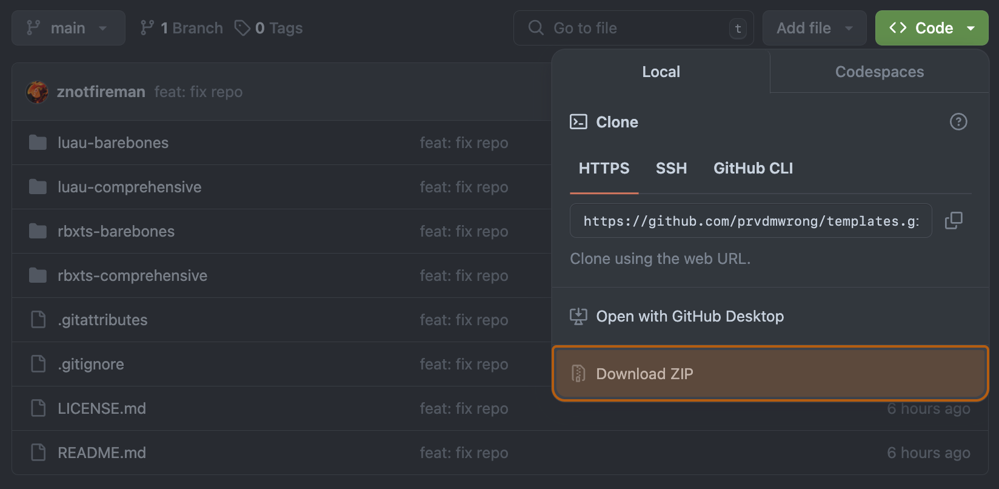

# Installation

Prvd 'M Wrong is broken down into functional packages, which you will need to
import into your game. This page will walk you through installing a package.

---

## Templates

If preferred, Prvd 'M Wrong has batteries-included projects to be used as
templates found under the [`prvdmwrong/templates` repository.](https://github.com/prvdmwrong/templates)

1. Clone the templates repository:
      - On the web, head over to the [`prvdmwrong/templates` repository.](https://github.com/prvdmwrong/templates)
        and click the "Code" dropdown, then click "Download ZIP". Inside is a
        copy of the templates repository:

        

      - Alternatively, in a terminal, run the following command:

        ```Sh
        git clone https://github.com/prvdmwrong/templates.git
        cd templates
        ```

2. Use one of the following templates inside the repository:
      - For Luau projects:
        - Use the [`luau-barebones` template](https://github.com/prvdmwrong/templates/tree/main/luau-barebones)
          for a pre-configured barebones prelude.
        - Use the [`luau-comprehensive` template](https://github.com/prvdmwrong/templates/tree/main/luau-barebones)
          for a comprehensive prelude including Darklua string requires, Wally
          with types, and plenty of goodies.
      - For Roblox TypeScript projects:
        - Use the [`rbxts-barebones` template](https://github.com/prvdmwrong/templates/tree/main/rbxts-barebones)
          for a pre-configured barebones prelude.
        - Use the [`rbxts-comprehensive` template](https://github.com/prvdmwrong/templates/tree/main/luau-barebones)
          for a comprehensive prelude including ESLint and Prettier
          pre-configured.

---

## Manual Installation

For existing projects, Prvd 'M Wrong must be imported as individual packages.

### From Roblox

If you edit directly inside Roblox Studio, then you can import a Roblox model
file containing Prvd 'M Wrong.

1. Head over to [Prvd 'M Wrong's "Releases" page.](https://github.com/prvdmwrong/prvdmwrong/releases)
2. Find the package you will install, if you are just following the tutorials,
  you can install the `prvdmwrong` core package.
3. Click the "Assets" dropdown to view the downloadable files:
   
4. Click on the package you would like to import, which should end in `.rbxm`:
   
5. Open Roblox Studio to import the model. If you are just following the
  tutorials, just an empty baseplate will do.
6. Right-click on `ReplicatedStorage`, and select "Insert from File":
   
7. You should see an `prvdmwrong` module script appear in ReplicatedStorage!

---

### From Wally/Pesde

If you use [Wally](https://wally.run/) or [Pesde](https://pesde.daimond113.com/)
for Luau, Prvd 'M Wrong has packages for both package managers.

=== "Wally"

    1. Head over to one of these packages you will import:

          - [`@prvdmwrong/core`](https://wally.run/package/prvdmwrong/core)
            for the core package
          - [`@prvdmwrong/lifecycles`](https://wally.run/package/prvdmwrong/lifecycles)
            for additional lifecycle methods

    2. Copy the metadata below "Install", and append it below `[dependencies]` in
    your `wally.toml`:

        ```TOML
        [dependencies]
          prvd = "prvdmwrong/core@0.2.0-dev.8"
        ```

    3. Install your packages:

        ```Sh
        wally install
        ```

        This will install Prvd 'M Wrong under the `Packages` directory, which is
        usually located in `ReplicatedStorage`:

        ```Lua
        local prvd = require(ReplicatedStorage.Packages.prvd)
        ```

        If you'd want the linker modules to also export types, you can use the
        [Wally Package Types](https://github.com/JohnnyMorganz/wally-package-types)
        tool:

        ```Sh
        wally-package-types --sourcemap sourcemap.json Packages/
        ```

=== "Pesde"

    1. Head over to one of these packages you will import:

          - [`@prvdmwrong/core`](https://pesde.daimond113.com/packages/prvdmwrong/core/0.2.0-dev.8)
            for the core package
          - [`@prvdmwrong/lifecycles`](https://pesde.daimond113.com/packages/prvdmwrong/lifecycles/0.2.0-dev.8)
            for additional lifecycle methods

    2. Run the command below "Installation", which will look like below:

        ```Sh
        $ pesde add prvdmwrong/lifecycles@0.2.0-dev.8
        ```

---

### From NPM

If you use Roblox TypeScript, Prvd 'M Wrong has type definitions and packages
for [NPM](https://www.npmjs.com/).

1. Head over to one of these packages you will import:

      - [`@prvdmwrong/core`](https://www.npmjs.com/package/@prvdmwrong/core)
        for the core package
      - [`@prvdmwrong/lifecycles`](https://www.npmjs.com/package/@prvdmwrong/lifecycles)
        for additional lifecycle methods

2. Copy the command below "Install", and run it on a terminal:

    ```Sh
    npm i prvdmwrong/core
    ```

3. Roblox TypeScript does not include Prvd 'M Wrong in the project. Find
    `node_modules` in your project file, it may be nested behind several levels:

    ```JSON
    "node_modules": {
      "@rbxts": {
        "$path": "node_modules/@rbxts"
      }
    }
    ```

    Add the `@prvdmwrong` scope next to `@rbxts`:

    ```JSON
    "node_modules": {
      "@rbxts": {
        "$path": "node_modules/@rbxts"
      },
      "@prvdmwrong": {
        "$path": "node_modules/@prvdmwrong"
      }
    }
    ```

4. Roblox TypeScript needs Prvd 'M Wrong to be included as a type root. Find
   `typeRoots` in your `tsconfig.json` file, it may be nested behind several
   levels:

      ```JSON
      "typeRoots": [
        "node_modules/@rbxts"
      ],
      ```

      Add `node_modules/@prvdmwrong` next to `node_modules/@rbxts`:

      ```JSON
      "typeRoots": [
        "node_modules/@rbxts",
        "node_modules/@prvdmwrong"
      ],
      ```

5. Now Prvd 'M Wrong can imported directly:

    ```TypeScript
    import prvd from "@prvdmwrong/core"
    ```

---

### From Source

If you are synchronizing external files into Roblox Studio, Prvd 'M Wrong can be
imported as source code.

1. Head over to [Prvd 'M Wrong's 'Releases' page.](https://github.com/prvdmwrong/prvdmwrong/releases)
2. Click the "Assets" dropdown to view the downloadable files:
   
3. Under "Assets", download `Source code (zip)`. Inside is a copy of the Prvd 'M
  Wrong GitHub repository:
   
4. You need to build the packages itself to use it. Prvd 'M Wrong uses
   [Rokit](https://github.com/rojo-rbx/rokit) for tooling:

      ```Sh
      rokit install
      ```

5. Run the build script and follow the prompts to build a package:

      ```Sh
      $ lune run build-pkg
      ✔ Select packages to build, or none to build all packages · core, lifecycles
      ✔ Build .rbxm models? · yes
      ✔ Publish these packages to NPM and Wally? · no
      ```

6. The build script will create a `dist` with the built distributables. You can
   copy the created distributables and place it next to your libraries.

---

## Testing

Now, you can create a script for testing:

1. Create a `Script` under `ServerScriptService`.
2. Remove the following code, and paste this in. Tweak the require/import
   statement to point at the installed package depending on your installation:

    === "Luau"

        ```Lua
        local ReplicatedStorage = game:GetService("ReplicatedStorage")
        local prvd = require(ReplicatedStorage.Packages.prvdmwrong)
        ```

    === "TypeScript"

        ```TypeScript
        import prvdmwrong from "@rbxts/prvdmwrong"
        ```

3. Playtest your game - if there are no errors, everything was set up correctly!

??? failure "My script didn't work!"

    ```
    prvdmwrong is not a valid member of ReplicatedStorage "ReplicatedStorage"
    ```
    If you're seeing this error, then your script can't find Prvd 'M Wrong.

    This code assumes you've placed Prvd 'M Wrong under ReplicatedStorage. If
    you've installed both elsewhere, you'll need to the `require()` to point
    towards the correct location.

    If both looks like it points to the correct location, refer back to the
    previous section and double-check you've set everything up properly. Make
    sure under ReplicatedStorage, there's a ModuleScript named `prvdmwrong`.
