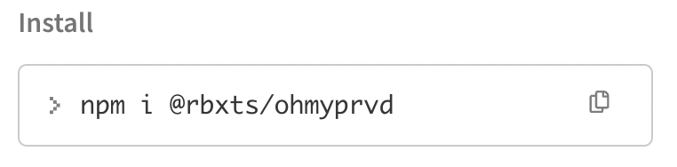

# Installation

Oh My Prvd is broken down into functional packages, which you will need to
import into your game. This page will walk you through installing a package.

---

## Methods

### Install via Roblox

If you edit directly inside Roblox Studio, then you can import a Roblox model
file containing Oh My Prvd.

1. Head over to [Oh My Prvd's "Releases" page.](https://github.com/team-fireworks/ohmyprvd/releases)
2. Find the package you will install, if you are just following the tutorials,
  you can install the `ohmyprvd` core package.
3. Click the "Assets" dropdown to view the downloadable files:
   
4. Click on the package you would like to import, which should end in `.rbxm`:
   
5. Open Roblox Studio to import the model. If you are just following the
  tutorials, just an empty baseplate will do.
6. Right-click on `ReplicatedStorage`, and select "Insert from File":
   
7. You should see an `ohmyprvd` module script appear in ReplicatedStorage!

---

### Install via a Package Manager

If you use [Wally](https://wally.run/) for Luau or [NPM](https://www.npmjs.com/)
for TypeScript, Oh My Prvd has packages for both package managers.

=== "Wally"

    1. Head over to one of these packages you will import:

          - [`@znotfireman/ohmyprvd`](https://wally.run/package/znotfireman/ohmyprvd)
            for the core package
          - [`@znotfireman/ohmyprvd-lifecycles`](https://wally.run/package/znotfireman/ohmyprvd-lifecycles)
            for additional lifecycle methods

    2. Copy the metadata below "Install", and append it below `[dependencies]` in
    your `wally.toml`:

        

        It will look something as such, with `ohmyprvd` renamed to `prvd` for
        brevity:

        ```TOML
        [dependencies]
          prvd = "znotfireman/ohmyprvd@0.1.1-alpha"
        ```

    3. Then, install your packages:

        ```Bash
        $ wally install
        ```

        This will install Oh My Prvd under the `Packages` directory, which is
        usually located in `ReplicatedStorage`:

        ```Lua
        local prvd = require(ReplicatedStorage.Packages.prvd)
        ```

    4. If you'd want the linker modules to also export types, you can use the
        [Wally Package Types](https://github.com/JohnnyMorganz/wally-package-types)
        tool:

        ```Bash
        $ wally-package-types --sourcemap sourcemap.json Packages/
        ```

=== "NPM"

    1. Head over to one of these packages you will import:

          - [`@rbxts/ohmyprvd`](https://www.npmjs.com/package/@rbxts/ohmyprvd)
            for the core package

    2. Copy the command below "Install", and run it on a terminal:

        

    3. This will install Oh My Prvd under `node_modules`, which can be imported
    directly:

        ```TypeScript
        import ohmyprvd from "@rbxts/ohmyprvd"
        ```

---

### Install via Source

If you are synchronizing external files into Roblox Studio, Oh My Prvd can be
imported as source code.

1. Head over to [Oh My Prvd's 'Releases' page.](https://github.com/team-fireworks/ohmyprvd/releases)
2. Click the "Assets" dropdown to view the downloadable files:
   
3. Under "Assets", download `Source code (zip)`. Inside is a copy of the Oh My
  Prvd GitHub repository.:
   
4. Inside the zip, open `packages`, then the package you'd like to import,
  and copy it's `lib` folder; it may be inside another folder.
5. Create a new folder inside your project named "ohmyprvd", place it wherever
  you keep your libraries.
   - For example, you might paste it inside a `shared` or a `packages` folder.
6. Paste the contents of the `lib` folder into the newly created folder.

---

## Testing

Now, you can create a script for testing:

1. Create a `Script` under `ServerScriptService`.
2. Remove the following code, and paste this in depending on your installation:

    === "Roblox"

        ```Lua
        local ReplicatedStorage = game:GetService("ReplicatedStorage")
        local prvd = require(ReplicatedStorage.ohmyprvd)
        ```

    === "Wally"

        ```Lua
        local ReplicatedStorage = game:GetService("ReplicatedStorage")
        local prvd = require(ReplicatedStorage.Packages.ohmyprvd)
        ```

    === "NPM"

        ```TypeScript
        import ohmyprvd from "@rbxts/ohmyprvd"
        ```

    === "Darklua"

        ```Lua
        local prvd = require("@pkg/ohmyprvd")
        ```

3. Playtest your game - if there are no errors, everything was set up correctly!

??? failure "My script didn't work!"

    ```
    ohmyprvd is not a valid member of ReplicatedStorage "ReplicatedStorage"
    ```
    If you're seeing this error, then your script can't find Oh My Prvd.

    This code assumes you've placed Oh My Prvd under ReplicatedStorage. If
    you've installed both elsewhere, you'll need to the `require()` to point
    towards the correct location.

    If both looks like it points to the correct location, refer back to the
    previous section and double-check you've set everything up properly. Make
    sure under ReplicatedStorage, there's a ModuleScript named `ohmyprvd`.
